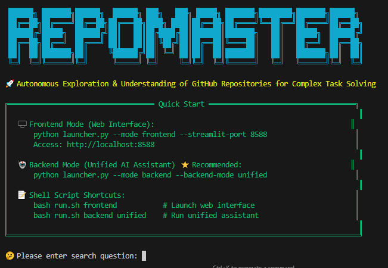

<div align="center">

  

# RepoMaster: Autonomous Exploration and Understanding of GitHub Repositories for Complex Task Solving

  <p style="margin: 10px 0;">
    <a href="https://arxiv.org/pdf/2505.21577"></a>
    
    
  </p>

  <p style="font-size: 15px; color: gray; margin-top: 4px;">
    🌐 <a href="README.md">English</a> | <a href="README_CN.md">中文</a>
  </p>

</div>

**🎯 Quick Navigation**: [Installation](#-quick-start) | [Demo](#-quick-demo) | [Documentation](docs/user-guide.md)

## 🚀 Overview

RepoMaster is a revolutionary autonomous agent framework specifically designed to explore, understand, and utilize GitHub repositories for solving complex real-world tasks. Unlike traditional approaches that generate code from scratch, RepoMaster treats open-source repositories on GitHub as composable tool modules, automatically leveraging these resources through intelligent search, hierarchical analysis, and autonomous exploration.


---

## 🚀 Quick Start

### 🛠️ Installation

**Install Dependencies**:
```bash
git clone https://github.com/QuantaAlpha/RepoMaster.git
cd RepoMaster
pip install -r requirements.txt
```

**Configure API Keys**:
Create `configs/.env` file:
```bash
# Set the default API provider (openai, claude, deepseek, azure_openai)
OPENAI_API_KEY=your_openai_key
OPENAI_MODEL=openai_model

Serper_API_KEY=your_serper_key          # For Google search results
JINA_API_KEY=your_jina_key              # For web content extraction
```

### 🚀 Run RepoMaster

**Frontend Mode (Web Interface)**:
```bash
python launcher.py --mode frontend
# Access: http://localhost:8501
```


**Backend Mode (Recommended)**:

```bash
python launcher.py --mode backend --backend-mode unified
```

**Shell Script Shortcuts**:
```bash
bash run.sh frontend      # Frontend mode
bash run.sh backend unified  # Backend unified mode
```

> 📘 **For detailed configuration and advanced options, please refer to our [User Guide](docs/user-guide.md).**


---

## 🎯 Quick Demo

Imagine describing a task in natural language, and RepoMaster automatically handles the rest: from finding the most suitable GitHub repository and understanding its complex code structure, to finally executing and completing the task! RepoMaster can handle everything from simple data extraction to complex AI model applications.

**Simply describe your task in natural language, RepoMaster handles everything else!**

| Task Description | RepoMaster Action | Result |
|------------------|-------------------|---------|
| *"Help me scrape product prices from this webpage"* | 🔍 Find scraping tools → 🔧 Auto-configure → ✅ Extract data | Structured CSV output |
| *"Transform photo into Van Gogh style"* | 🔍 Find style transfer repos → 🎨 Process images → ✅ Generate art | Artistic masterpiece |

### 🎨 Neural Style Transfer Demo

<table>
<tr>
<td align="center"><b>Original Image</b></td>
<td align="center"><b>Style Reference</b></td>
<td align="center"><b>Transfer Result</b></td>
</tr>
<tr>
<td></td>
<td></td>
<td></td>
</tr>
</table>

**Automated Workflow**:
1. 🔍 **Smart Search**: Find style transfer repositories on GitHub
2. 🏗️ **Structure Analysis**: Analyze code structure and pipelines
3. 🔧 **Autonomous Execution**: Configure environment and process images
4. ✅ **Task Completion**: Generate results without human intervention

### 🎬 Complete Execution Demo | [📺 YouTube Demo](https://www.youtube.com/watch?v=Kva2wVhBkDU)

<div align="center">

https://github.com/user-attachments/assets/a21b2f2e-a31c-4afd-953d-d143beef781a

*Complete process of RepoMaster autonomously executing neural style transfer task*

</div>

**For advanced usage, configuration options, and troubleshooting, see our [User Guide](docs/user-guide.md).**

---

## 🤝 Contributing

We welcome contributions! Please see our [Contributing Guidelines](CONTRIBUTING.md).

### Development Setup
```bash
git clone https://github.com/QuantaAlpha/RepoMaster.git
cd RepoMaster
pip install -e ".[dev]"
pre-commit install
```

---

## 📄 License

This project is licensed under the MIT License - see the [LICENSE](LICENSE) file for details.

---

## 📞 Support

- 📧 **Email**: quantaalpha.ai@gmail.com
- 🐛 **Issues**: [GitHub Issues](https://github.com/QuantaAlpha/RepoMaster/issues)
- 💬 **Discussions**: [GitHub Discussions](https://github.com/QuantaAlpha/RepoMaster/discussions)
- 📖 **Documentation**: [Full Documentation](docs/)

---

## 🙏 Acknowledgments

Special thanks to:
- [AutoGen](https://github.com/microsoft/autogen) - Multi-agent framework
- [OpenHands](https://github.com/All-Hands-AI/OpenHands) - Software engineering agents
- [SWE-Agent](https://github.com/princeton-nlp/SWE-agent) - GitHub issue resolution
- [MLE-Bench](https://github.com/openai/mle-bench) - ML engineering benchmarks

---

## 🌐 About QuantaAlpha

- QuantaAlpha was founded in **April 2025** by a team of professors, postdocs, PhDs, and master’s students from **Tsinghua University, Peking University, CAS, CMU, HKUST**, and more.  

🌟 Our mission is to explore the **“quantum”** of intelligence and pioneer the **“alpha”** frontier of agent research — from **CodeAgents** to **self-evolving intelligence**, and further to **financial and cross-domain specialized agents**, we are committed to redefining the boundaries of AI. 

✨ In **2025**, we will continue to produce high-quality research in the following directions:  
- **CodeAgent**: End-to-end autonomous execution of real-world tasks  
- **DeepResearch**: Deep reasoning and retrieval-augmented intelligence  
- **Agentic Reasoning / Agentic RL**: Agent-based reasoning and reinforcement learning  
- **Self-evolution and collaborative learning**: Evolution and coordination of multi-agent systems  

📢 We welcome students and researchers interested in these directions to join us!  

🔗 Team Homepage: [QuantaAlpha](https://quantaalpha.github.io/)

---

## 📖 Citation

If you find RepoMaster useful in your research, please cite our work:

```bibtex
@article{wang2025repomaster,
  title={RepoMaster: Autonomous Exploration and Understanding of GitHub Repositories for Complex Task Solving},
  author={Huacan Wang and Ziyi Ni and Shuo Zhang and Lu, Shuo and Sen Hu and  Ziyang He and Chen Hu and Jiaye Lin and Yifu Guo and Ronghao Chen and Xin Li and Daxin Jiang and Yuntao Du and Pin Lyu},
  journal={arXiv preprint arXiv:2505.21577},
  year={2025},
  doi={10.48550/arXiv.2505.21577},
  url={https://arxiv.org/abs/2505.21577}
}
```

---

<div align="center">

**⭐ If RepoMaster helps you, please give us a star!**

Made with ❤️ by the QuantaAlpha Team

</div>
